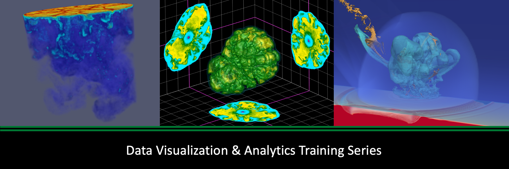

# Data Visualization and Analytics Training Series

    

The OLCF is proud to offer the Data Visualization and Analytics (DVA) training series.
The DVA training series is meant to highlight workflows, tools, software, and techniques used for common data visualization and analytics tasks -- specifically targeted at OLCF systems.

This repository contains the tutorials relevant to the various DVA events that have already happened or will happen in the future.

A list of the events (so far):

| Date     | Event                                 | Format | Material |
| :------- | :------------------------------------ | :----- | :------- |
| 12/08/21 | Analysis Tools at OLCF | OLCF User Conference Call | [Recording](https://vimeo.com/654969964), [Slides](https://www.olcf.ornl.gov/wp-content/uploads/2021/08/Dec_2021_Analysis_Tools_at_OLCF.pdf) |
| 07/14/22 | [Jupyter Workflow at OLCF](./jupyter) | Tutorial | [Recording](https://vimeo.com/730396217), [Overview slides](https://www.olcf.ornl.gov/wp-content/uploads/Jupyter_Overview.pdf), [Workflow slides](https://www.olcf.ornl.gov/wp-content/uploads/Jupyter_Analysis_Workflow.pdf), [DL slides](https://www.olcf.ornl.gov/wp-content/uploads/Jupyter_DL_Workflow.pdf) |
| 07/27/22 | Remote Visualization with VNC | OLCF User Conference Call | [Recording](https://vimeo.com/735781882), [Slides](https://www.olcf.ornl.gov/wp-content/uploads/Jul_2022_VNC.pdf) |
| 08/31/22 | Andes Overview | OLCF User Conference Call| [Recording](https://vimeo.com/745108997), [Slides](https://www.olcf.ornl.gov/wp-content/uploads/Andes_User_Call_08_31_22.pdf) |
| 09/15/22 | [ParaView at OLCF](./paraview)        | Tutorial | [Recording](https://vimeo.com/750382858), [Tutorial](https://kmorel.gitlab.io/pv-tutorial-olcf-2022/) |
| 10/13/22 | [VisIt at OLCF](./visit)              | Tutorial | [Recording](https://vimeo.com/760322024), [Tutorial](https://github.com/olcf/dva-training-series/blob/main/visit/README.md) |
| 06/28/23 | Blender on Frontier | OLCF User Conference Call | [Recording](https://vimeo.com/840891737), [Slides](https://www.olcf.ornl.gov/wp-content/uploads/Blender_on_Frontier_published.pdf) |
| 09/27/23 | In Situ Visualization with Ascent | OLCF User Conference Call | [Recording](https://vimeo.com/869656937), [Slides](https://www.olcf.ornl.gov/wp-content/uploads/Ascent_Tutorial_Sep2023.pdf) |
| 08/29/24 | [ParaView on Frontier](./paraview_2024)    | Tutorial | [Recording](https://vimeo.com/1004226604), [Tutorial](https://kmorel.gitlab.io/pv-tutorial-olcf-2024/) |
