# VisIt at OLCF 2022

DVA training series blurb/what is VisIT

Also download links

This is done on mac, but workflow should be similar

table of contents

## 1. Downloading VisIt

To connect to OLCF systems using VisIt, you must download and install a version of VisIt on your local machine that **matches** a version that is installed on the OLCF system you are trying to connect to.
Since we will be using Andes for this tutorial, we must use a version that is installed on Andes.
The latest version of VisIt that we have installed on Andes is version 3.2.2, so you will have to download and install that specific version before trying to connect.
In general, you can find out what versions of VisIt are installed on our machines by executing `module avail visit` when logged in via SSH.

> Note: Versions of VisIt older than 3.2.2 on Andes are known not to work properly.

You can find the 3.2.2 download on [VisIt's Website](https://visit-dav.github.io/visit-website/releases-as-tables/#series-32).

## 2. Setting up Host Profiles

### 2.1 Import OLCF Profiles

To be able to connect to OLCF systems, you will need to provide your local copy of VisIt the relevant OLCF server information -- also known as "host profiles".
You can manage your host profiles by going to "Options" &rarr; "Host Profiles".

    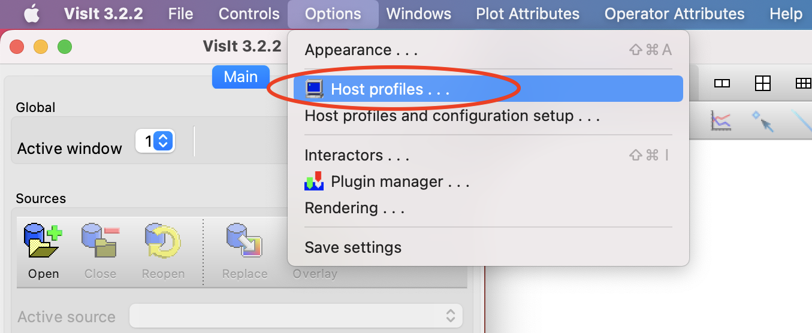

Here, you can manually provide host information or utilize VisIt's database of known hosts to automatically import the correct information.

> Note: Although the hosts in VisIt's database aren't always the most updated, the OLCF host information is currently accurate.

To retrieve the OLCF server information automatically:

1. Click on "Remote Profiles"
2. Click on "Update"
3. Click on "Oak Ridge National Laboratory Network"
4. Click on "Import"

> Note: An error/warning message may pop up about unrelated profiles from other centers -- you can dismiss this warning message.

    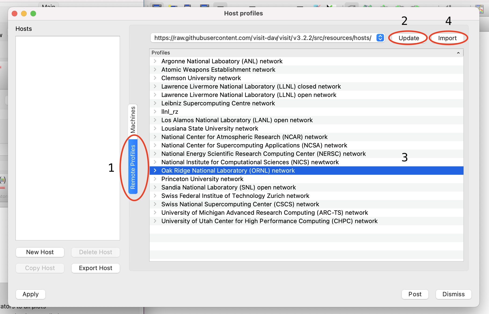

This will import the host information for both Summit and Andes -- today we will be using Andes.

Alternatively, you can manually create the host profiles yourself.
The manual creation process is outlined in detail in the [Visit Section of our Software Page](https://docs.olcf.ornl.gov/software/viz_tools/visit.html#installing-and-setting-up-visit).

### 2.2 Edit the Andes Profile

Although the Andes host information is accurate, you'll still have to edit your user information in the profile so that you'll be able to properly authenticate to Andes.
To edit the host profile with your user information (while still in the "Host Profiles" window):

1. Click on the Andes host profile in the "hosts" list (should be called something like "ORNL_Andes")
2. Click on "Machines"
3. Click on "Host Settings"
4. Change "Username" box to be your Moderate OLCF username
5. Click "Apply"
6. At the top menu click on "Options" &rarr; "Save Settings"

    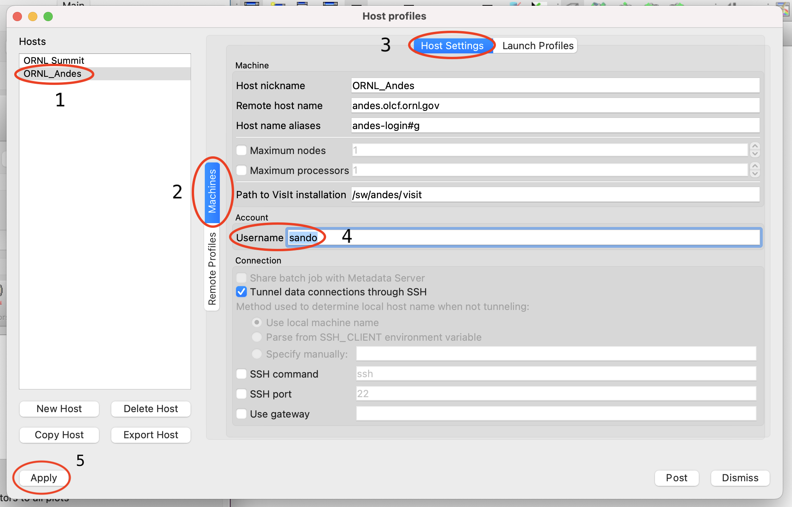

    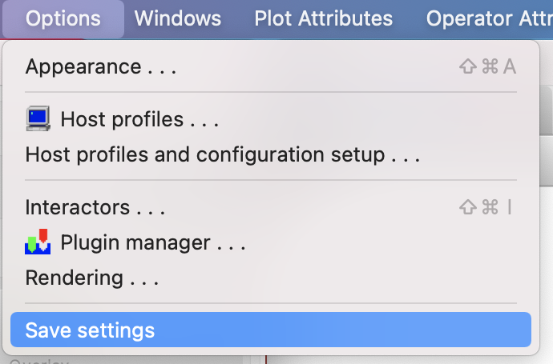

Next, you'll have to edit the job launching information so that you'll be able to run interactively on Andes.
To edit the job launching profile:

1. Click on "Launch Profiles"
2. Click on "New profile #0"
3. Click on "Parallel"
4. Change "Bank/Account" to your OLCF project with Andes allocation
5. Optional: Change default number of processors to 32 (max)
6. Optional: Click on "Settings"
7. Optional: Change profile name to "batch"
8. Click "Apply"
9. At the top menu click on "Options" &rarr; "Save Settings"

    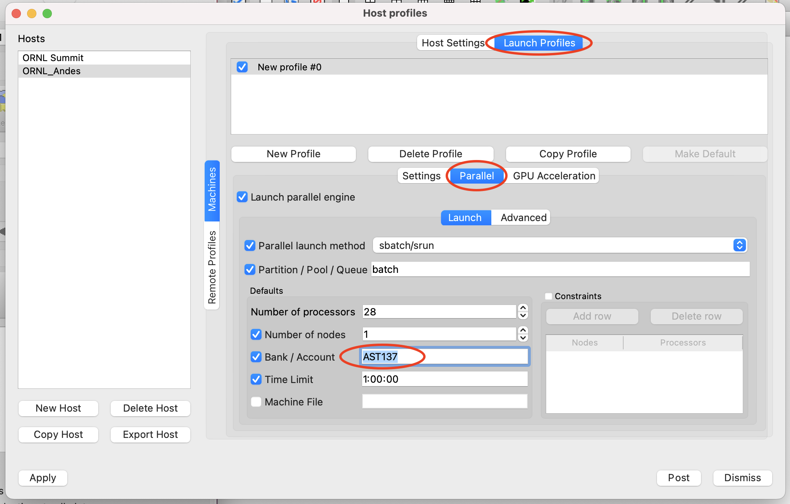

    

### 2.3 Optional: Add a GPU Partition Profile

Similarly, you can also setup a launch option to use Andes' `gpu` partition (typically runs faster for bigger datasets).
Under Andes' "Launch Profiles":

1. Click on "New Profile"
2. Name the profile something like "gpu"
3. Click on "Parallel"
4. Check "Launch Parallel Engine"
5. Set "Launch Method" to `sbatch/srun`
6. Set "Partition/Pool/Queue" to `gpu`
7. Set default number of processors to 28 (max without hyperthreading)
8. Set default number of nodes to 1
9. Set default "Bank/Account" to your OLCF project with Andes allocation
10. Set a default "Time Limit" in format of (HH:MM:SS)
11. Click "Apply"
12. At the top menu click on "Options" &rarr; "Save Settings"

## 3. Connecting to Andes

After setting up your host profile, you're ready to connect to Andes.
In VisIt's main window (see Figure below):

1. Click on the 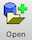 icon
2. Change the "Host" option to what you named your Andes host profile
3. Enter your PIN+Tokencode (as you normally would when SSHing to Andes)

    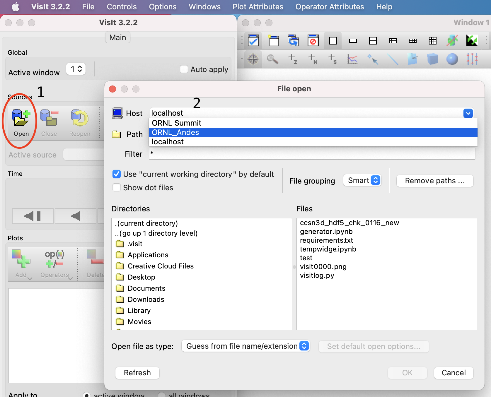

    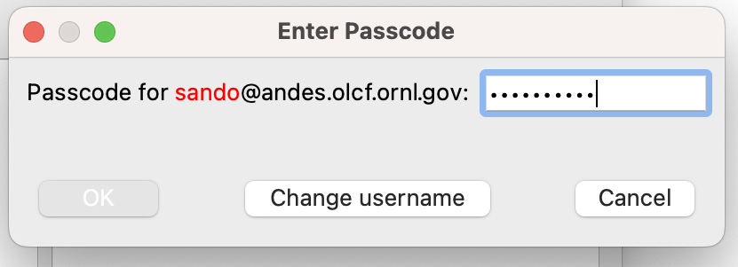

Congratulations, you are now connected to Andes!
The "File Open" window will still be open, since it is waiting for you to click on a file or database (dataset) to open, but you are otherwise connected to Andes.
We will now cover opening our first tutorial dataset.

## 4. Deep Impact Data

In this section of the tutorial, we will explore data from a shock physics simulation of an asteroid impact -- the data originally comes from the [2018 IEEE SciVis contest](https://sciviscontest2018.org/).
The simulation was studying the effects of large asteroids impacting the ocean and how it might propagate to land.

### 4.1 Opening the Data

Once connected:

1. Click on the  icon in VisIt's main control window.
2. Navigate to the `/gpfs/alpine/stf007/world-shared/msandov1/scivis_datasets/scivis_2018_deep_impact/yA31` directory in the `Path` box.
3. Make sure `File Grouping` is set to `Smart`
4. Click on the `pv_insitu_300x300x300_*.vti` database
5. Click `Ok`
6. Select which job launching profile to use.
7. Select your number of `Nodes` and `Procs` to be 1 and 1, respectively (this dataset runs faster with a small number of nodes and procs). Modify the `Bank` (project to charge) and `Time Limit` (HH:MM:SS) if necessary.
8. Select `Ok` and wait for your job to launch

    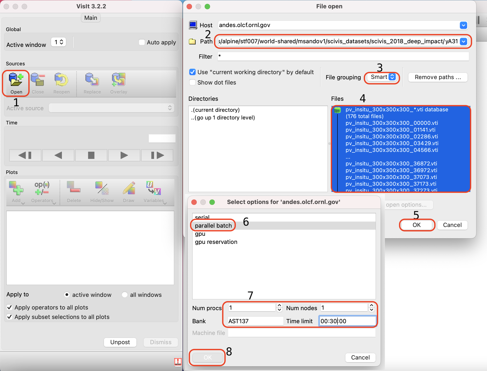

### 4.2 Making a 2D Slice

Once your job is running:

1. Add a plot by clicking on the 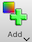 icon. More specifically, add a `Pseudocolor` plot of the variable `prs`.
2. Add a `Slice` operator on the plot by clicking on the  icon, navigating to `Slicing`, and clicking on the 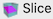 option.
3. Expand your plot details by clicking on the  icon.
4. Double click on your  property and change the `Orthogonal` option to `Z Axis` in the "Slice Operator Attributes" window.
5. Hit "Apply" and close the operator attributes window.
6. Click on the  icon to generate your plot.

    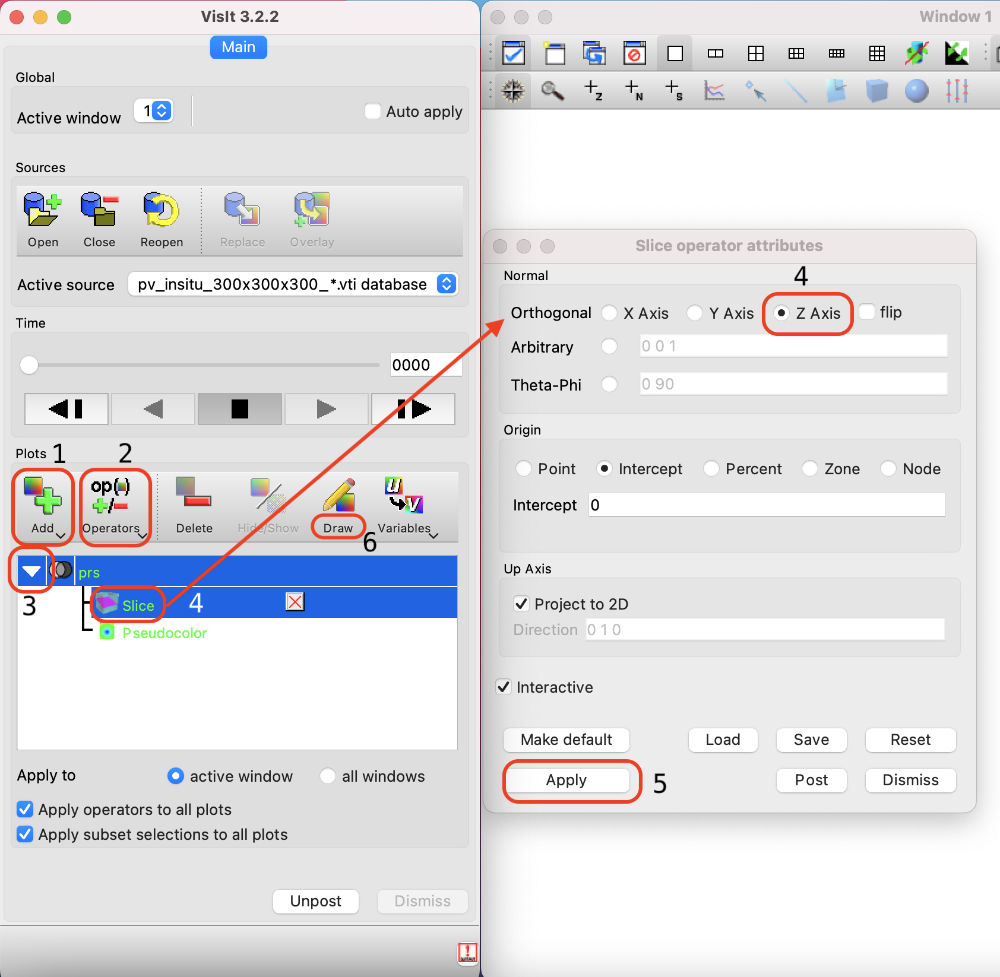

#### 4.2.1 Scaling the Pressure Data (Modifying the Slice)

Let's scale the colormap so that we can more easily visualize the data, as well as moving to a different timestep to see more "interesting" parts of the simulation.

1. Double click on your `prs` plot to open up the "Pseudocolor plot attributes" window.
2. Check the `Minimum` box and set it to `1e4`
3. Check the `Maximum` box and set it to `1e9`
4. Select the `Log` scaling option
5. Change the `Color Table` from `Default` to `hot_desaturated`
5. Hit "Apply" and close the pseudocolor attributes window.
6. Play through timesteps to see how the simulation progresses over time by using the  (play),  (stop/pause), and  (advance 1 frame) buttons.

Alternatively, you can use the time slider or manually enter a timestep in the time slider's text box to advance to a specific timestep.

    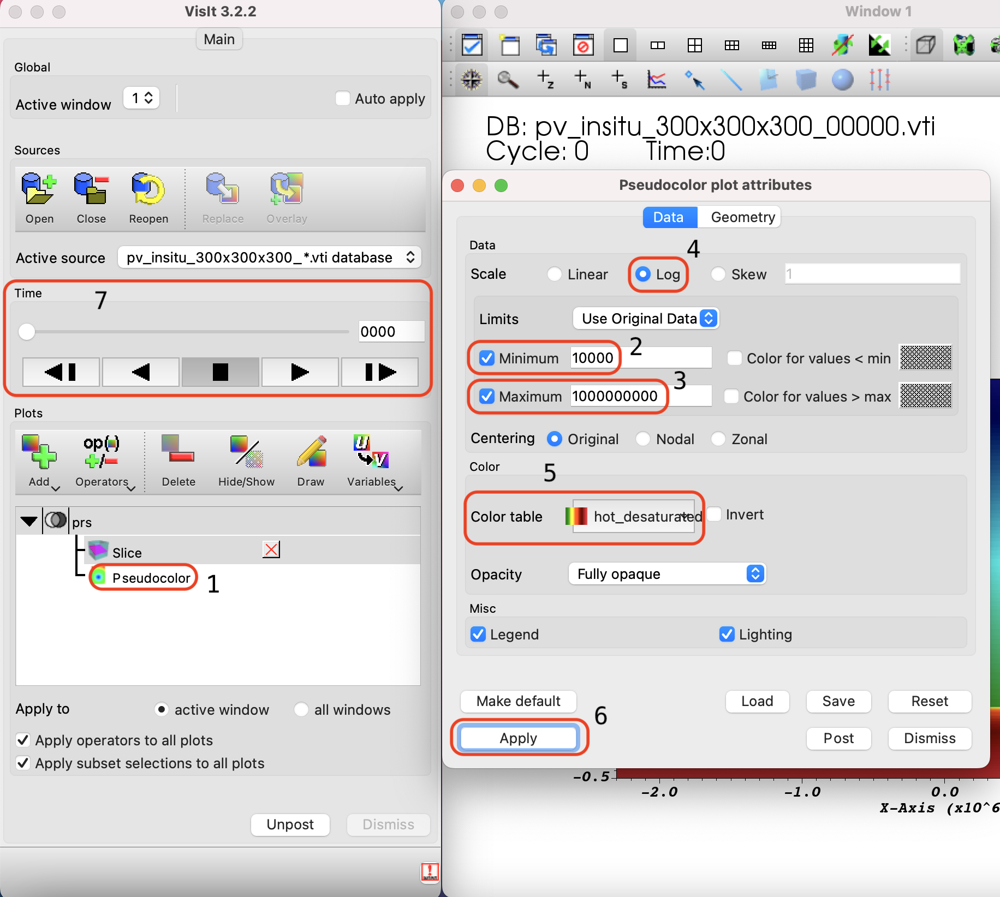

#### 4.2.2 Overlaying More Plots (Modifying the Slice)

First, let's change how we're visualizing our current `prs` plot:

1. Double click on your `prs` plot to open up the "Pseudocolor plot attributes" window.
2. Change the `Color Table` from `hot_desaturated` to `Greys`
3. Click "Apply"

    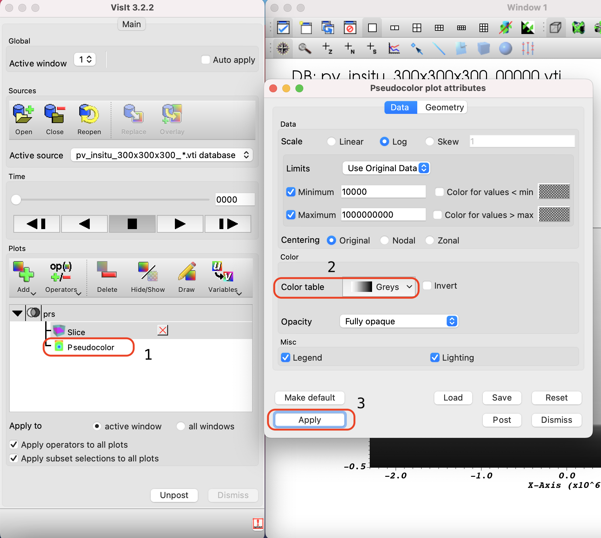

Next, let's overlay a plot of the water the asteroid hits.
That data is stored in the `v02` variable and can be thought of as the fraction/ratio of water:

1. Make sure that "Apply operators to all plots" is selected. This allows additional plots to inherit the same slice we applied to the `prs` plot.
2. Add a pseudocolor plot of `v02` by clicking on the  icon.
3. Double click on your `v02` plot to open up the "Pseudocolor plot attributes" window.
4. Check the `Minimum` box and set it to `0`
5. Check the `Maximum` box and set it to `1`
6. Select the `Linear` scaling option
7. Change the `Color Table` to `Blues`
8. Set `Opacity` to `Ramp`. With this setting, values of `v02` that are closer to 0 are more transparent, while values closer to 1 are more opaque.
9. Hit "Apply" and close the operator attributes window.
10. Click on the  icon to generate your plot.

    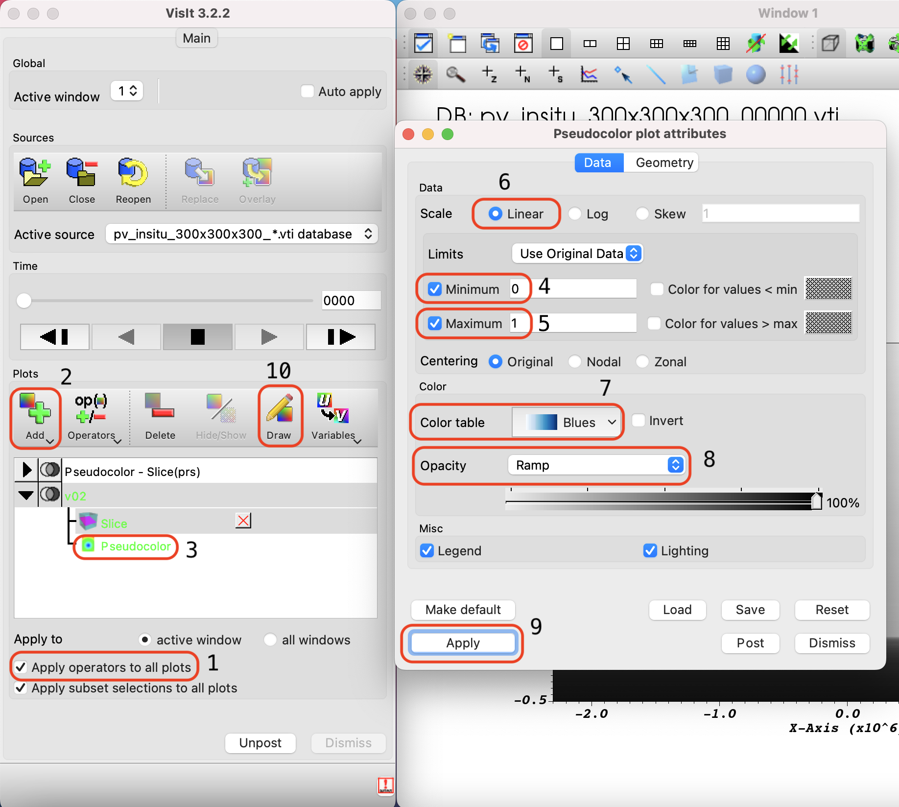

Lastly, let's overlay a plot of the asteroid itself, using the `v03` variable.
Because we intend this plot to be the same as the `v02` plot we just added, just with a different variable / colormap, we can use a shortcut:

1. Right-click (or control-click on Mac) your `v02` plot and select the `Clone` option
2. Select or highlight your new plot/clone (click on it once), then click on the 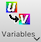 icon and select `v03` to swap variables to `v03` for this clone.
3. Double click on your `v03` plot to open up the "Pseudocolor plot attributes" window.
4. Change the `Color Table` to `Oranges`
5. Hit "Apply" and close the operator attributes window.
6. Click on the  icon to generate your plot.
7. Play through timesteps to see how the simulation progresses over time by using the  (play),  (stop/pause), and  (advance 1 frame) buttons.

    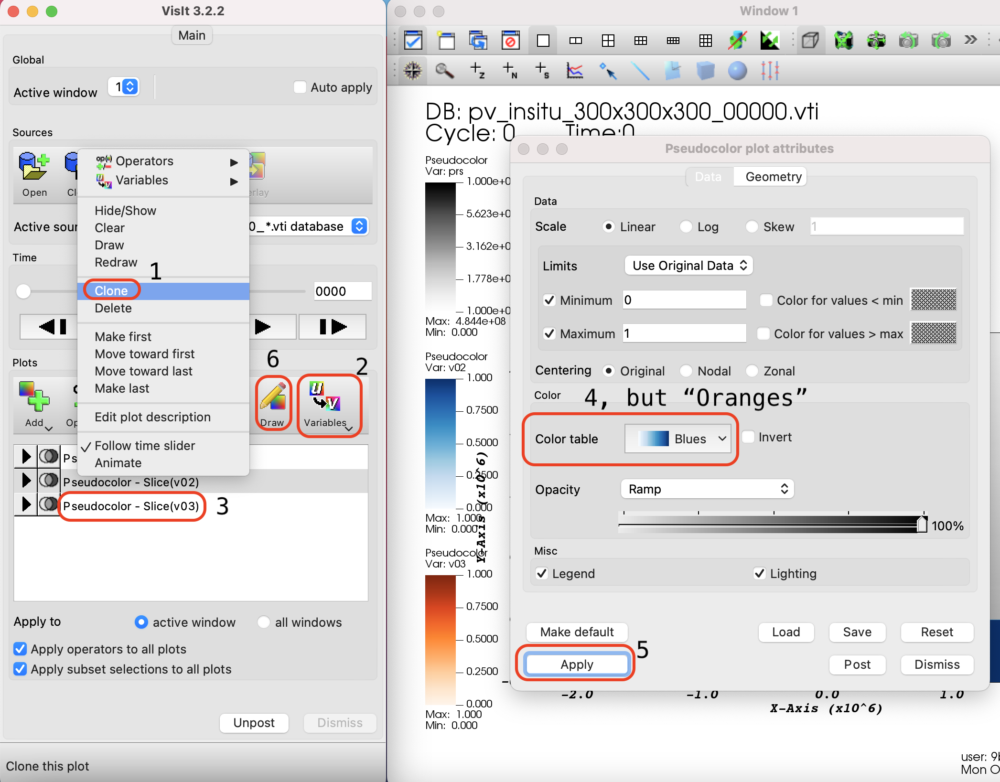

Now you can see the pressure, water, and asteroid all at the same time!

Although these images can be slow to generate, you can open the "Controls" &rarr; "Animation" window and select "Cache animation for faster playback" so that you can rewind and advance through already generated plots faster.
From that window you can also set the animation speed.

INSERT PICTURE HERE OF WHAT IT LOOKS LIKE FINAL

> Note: Later in this tutorial (see section XYZ) we will generate and save these images via batch processing.

### 4.3 Viewing in 3D-Space

Now that we have a general idea of how this looks along a specific 2D slice, let's view how this looks in 3D.
First, let's make a new window by cloning our old one (don't close the old window).
We're cloning the window because we're still going to use a `prs` slice; however, we're going to delete the `v02` and `v03` plots:

1. Using the menu bar, select "Windows" &rarr; "Clone" to create a new window.
2. Make sure your active window is `2`, as indicated by the `Active Window` option on the main VisIt control window.
3. Uncheck the "Apply operators to all plots" option. Although convenient most of the time, this can accidentally overwrite some plot operators we use in this workflow.
4. Expand your `prs` plot details by clicking on the  icon, and then double click on your  property to uncheck the `Project to 2D` option.
5. Hit "Apply" and close the slice operator attributes window.
6. Double click on your `prs` plot to open up the "Pseudocolor plot attributes" window, and then change the `Color Table` to `difference` and select the `Invert` option.
7. Click "Apply"
8. Delete your `v02` and `v03` pseudocolor plots by selecting them and clicking the 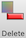 icon

    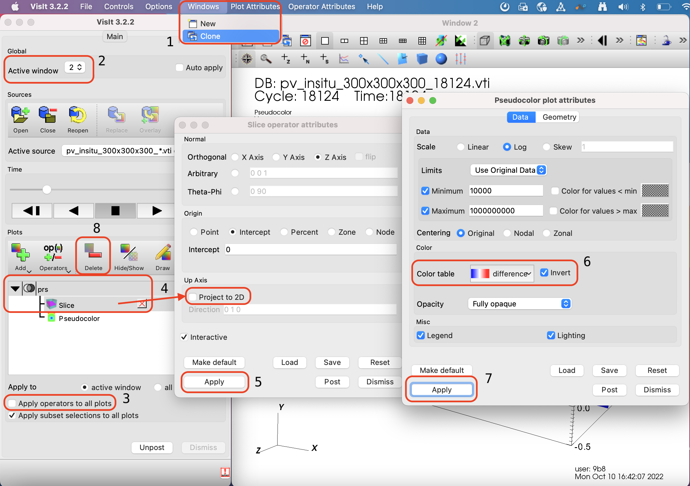

Now, let's see how a 0.5 isosurface looks in 3D for both the water (`v02`) and the asteroid  (`v03`).
An isosurface is essentially a 3D contour of the data -- in this case we're going to create a contour of 0.5 for `v02` and `v03` (i.e., where cells marked as 50% water reside, and were cells marked as 50% asteroid reside).

1. Click on the  icon, navigate to `Subset` option, and select the `mesh` option.
2. Add an `Isosurface` operator on the plot by clicking on the  icon, navigating to `Slicing`, and clicking on the 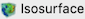 option.
3. Expand your plot details by clicking on the  icon, and then double click on your  property to change the `Select by` option to `Value(s)`
4. Input `0.5` into the `Value(s)` box
5. Change the `variable` option to `v02`
6. Hit "Apply" and close the "Isosurface operator attributes" window.
7. Double click on your  property to change the color to some form of blue.
8. Using the slider, change the opacity to `50%`. Note that this is unrelated to the 0.5 value we chose earlier and that this is just so we can have some transparency.
9. Hit "Apply" and close the "Subset plot attributes" window.
10. Repeat steps 1-9, but for the variable `v03` and pick an orange or brown color for the asteroid in step 7.
11. Click on the  icon to generate your plots.

    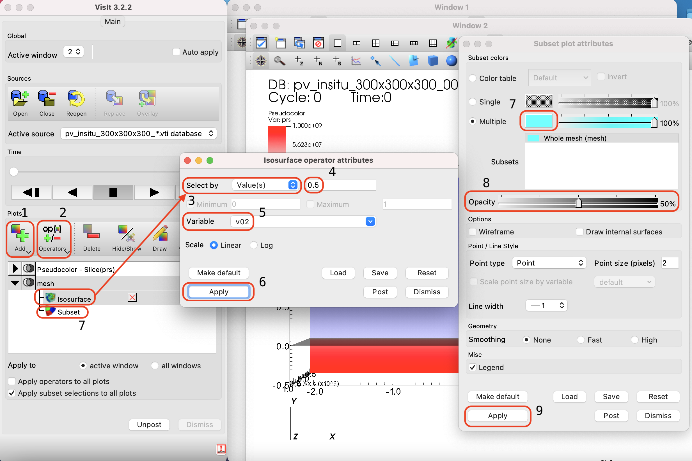

* To navigate around the 3D space: click on the  icon -- you can then click and drag on the 3D plot to rotate around the 3D space.
* To zoom to a specific location: click on the  icon -- you can then click and drag on the 3D plot to zoom.
* To reset your camera to the default view and zoom: click on the  icon.

INSERT PICTURE HERE OF WHAT IT LOOKS LIKE FINAL AT SPECIFC TIMESTEP with plot window shown

#### 4.3.1 Optional: Styling and Syncing Windows

Let's polish things a bit by changing the foreground colors of Window 2 (which will make the colors pop and easier to see), and also sync Window 1 and 2 so that we can visualize timesteps simultaneously across both windows.

1. Select Window 2 and click on the invert colors  icon in the window 2 toolbar.
2. Select the time correlation/sync  icon in the window 2 toolbar. (Note that this may be hidden behind a  icon in the top right)
3. Select Window 1 and repeat step 2.

    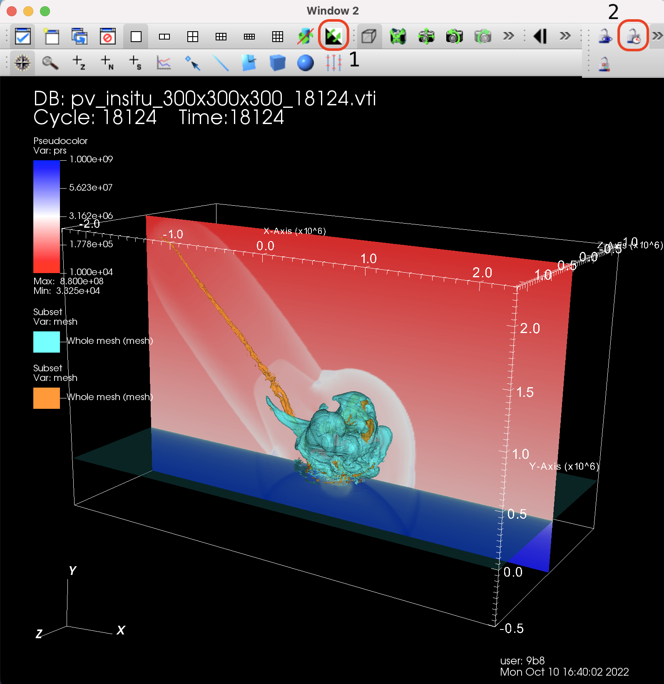

## 5. Supernova Data

delete plots, close windows, can even restart (i suggest this)

here goes supernova data

## misc things

now that know workflow, reducing number of steps for second dataset

additional tips:

save session / restore session

always save settings

deleting / remaking host profiles

cache animation

zooming with keyframes

record feature (warn sometimes outdated, best to just use manual)

clone window and replace databases