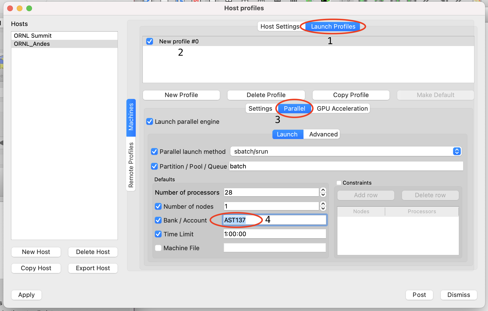
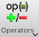
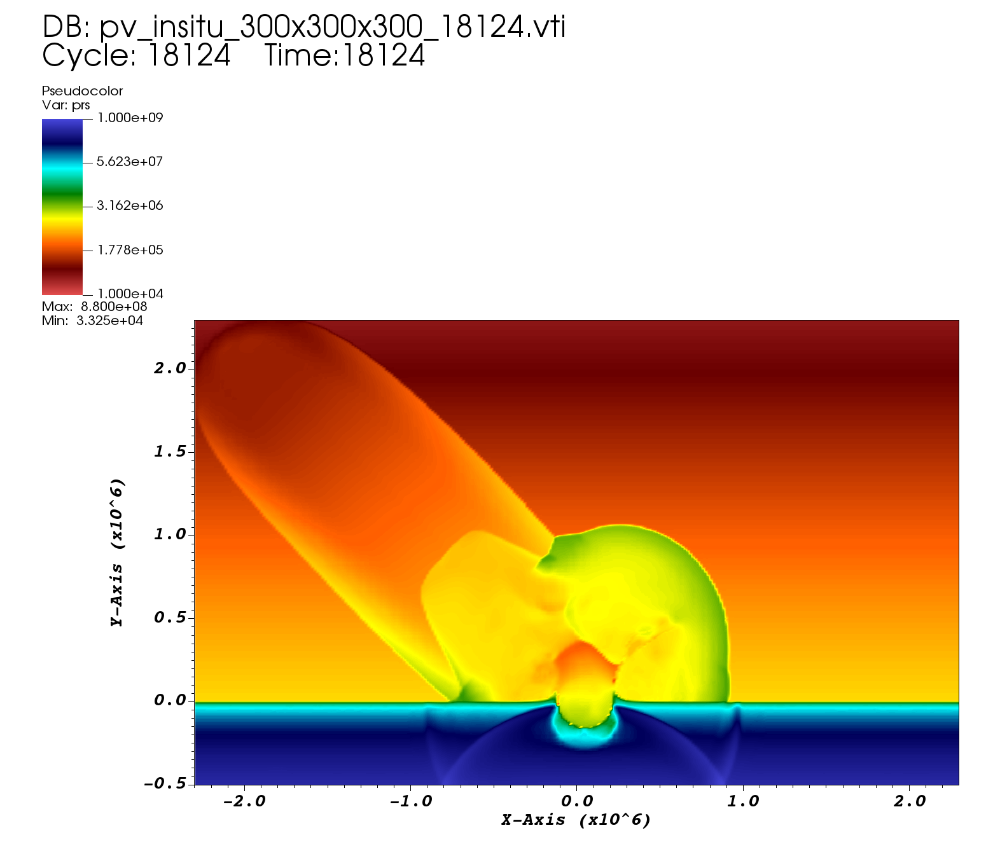

# VisIt at OLCF 2022

> **Video recording / demo of this tutorial:** <https://vimeo.com/760322024>

[VisIt](https://visit-dav.github.io/visit-website/) is an interactive, parallel analysis and visualization tool for scientific data.
Users can visualize data interactively or offload visualization using a Python script to analyze data ranging in scale from small projects to large leadership-class computing simulations.
Users can generate visualizations, animate them through time, manipulate them with a variety of operators and mathematical expressions, and save the resulting images and animations. Owing to its customizable plugin design, VisIt is capable of visualizing data from over 120 different scientific data formats.

[OLCF provides VisIt](https://docs.olcf.ornl.gov/software/viz_tools/visit.html) server installs on Andes and Summit to facilitate large scale distributed visualizations.
VisIt may be used in a GUI mode that runs on your local machine while remotely connected to OLCF systems, or used in a batch script to offload visualizations on OLCF systems when interactivity isn’t needed.

This beginner friendly demo will provide an overview of how to access VisIt at OLCF and a tutorial of how to use VisIt to visualize different datasets on Andes.

This walkthrough is performed on Mac, but the workflow will be the same for other platforms.

Table of Contents:

* [Downloading VisIt](#download)
* [Setting up Host Profiles](#setup)
	* [Import OLCF Profiles](#import)
	* [Edit the Andes Profile](#andes_profile)
	* [Add a GPU Partition Profile](#gpu_profile)
* [Connecting to Andes](#connecting)
* [Deep Impact Data](#impact)
	* [Opening the Data](#impact-opening)
	* [Making a 2D Slice](#impact-slice)
		* [Scaling the Pressure Data](#impact-scaling)
		* [Overlaying More Plots](#impact-overlaying)
	* [Viewing in 3D Space](#impact-3d)
		* [Styling and Syncing Windows](#impact-styling)
* [Supernova Data](#supernova)
	* [Opening the Data](#supernova-opening)
	* [Defining New Variables](#supernova-defining)
	* [Making a 3D Volume Plot](#supernova-volume)
		* [Switching Volume Renderers](#supernova-renderer)
		* [Editing the Transfer Function](#supernova-transfer)
* [Batch Processing](#batch)
* [Additional Tips](#tips)


## 1. <a name="download"></a> Downloading VisIt

To connect to OLCF systems using VisIt, you must download and install a version of VisIt on your local machine that **matches** a version that is installed on the OLCF system you are trying to connect to.
Since we will be using Andes for this tutorial, we must use a version that is installed on Andes.
The latest version of VisIt that we have installed on Andes is version 3.2.2, so you will have to download and install that specific version before trying to connect.
In general, you can find out what versions of VisIt are installed on our machines by executing `module avail visit` when logged in via SSH.

> Note: Versions of VisIt older than 3.2.2 on Andes are known not to work properly.

You can find the 3.2.2 download on [VisIt's Website](https://visit-dav.github.io/visit-website/releases-as-tables/#series-32).

## 2. <a name="setup"></a> Setting up Host Profiles

### 2.1 <a name="import"></a> Import OLCF Profiles

To be able to connect to OLCF systems, you will need to provide your local copy of VisIt the relevant OLCF server information -- also known as "host profiles".
You can manage your host profiles by going to "Options" &rarr; "Host Profiles".

<p align="center" width="100%">
    
</p>

Here, you can manually provide host information or utilize VisIt's database of known hosts to automatically import the correct information.

> Note: Although the hosts in VisIt's database aren't always the most updated, the OLCF host information is currently accurate.

To retrieve the OLCF server information automatically:

1. Click on "Remote Profiles"
2. Click on "Update"
3. Click on "Oak Ridge National Laboratory Network"
4. Click on "Import"

> Note: An error/warning message may pop up about unrelated profiles from other centers -- you can dismiss this warning message.

<p align="center" width="100%">
    
</p>

This will import the host information for both Summit and Andes -- today we will be using Andes.

Alternatively, you can manually create the host profiles yourself.
The manual creation process is outlined in detail in the [Visit Section of our Software Page](https://docs.olcf.ornl.gov/software/viz_tools/visit.html#installing-and-setting-up-visit).

### 2.2 <a name="andes_profile"></a> Edit the Andes Profile

Although the Andes host information is accurate, you'll still have to edit your user information in the profile so that you'll be able to properly authenticate to Andes.
To edit the host profile with your user information (while still in the "Host Profiles" window):

1. Click on the Andes host profile in the "hosts" list (should be called something like "ORNL_Andes")
2. Click on "Machines"
3. Click on "Host Settings"
4. Change "Username" box to be your Moderate OLCF username
5. Click "Apply"
6. At the top menu click on "Options" &rarr; "Save Settings"

<p align="center" width="100%">
    
</p>

<p align="center" width="100%">
    
</p>

Next, you'll have to edit the job launching information so that you'll be able to run interactively on Andes.
To edit the job launching profile:

1. Click on "Launch Profiles"
2. Click on "New profile #0"
3. Click on "Parallel"
4. Change "Bank/Account" to your OLCF project with Andes allocation
5. Optional: Change default number of processors to 32 (max)
6. Optional: Click on "Settings"
7. Optional: Change profile name to "batch"
8. Click "Apply"
9. At the top menu click on "Options" &rarr; "Save Settings"

<p align="center" width="100%">
    
</p>

<p align="center" width="100%">
    
</p>

### 2.3 <a name="gpu_profile"></a> Optional: Add a GPU Partition Profile

Similarly, you can also setup a launch option to use Andes' `gpu` partition (typically runs faster for bigger datasets).
Under Andes' "Launch Profiles":

1. Click on "New Profile"
2. Name the profile something like "gpu"
3. Click on "Parallel"
4. Check "Launch Parallel Engine"
5. Set "Launch Method" to `sbatch/srun`
6. Set "Partition/Pool/Queue" to `gpu`
7. Set default number of processors to 28 (max without hyperthreading)
8. Set default number of nodes to 1
9. Set default "Bank/Account" to your OLCF project with Andes allocation
10. Set a default "Time Limit" in format of (HH:MM:SS)
11. Click "Apply"
12. At the top menu click on "Options" &rarr; "Save Settings"

> Warning: The GPU profile cannot be used for the CCSN data described in [Section 5](#supernova)

## 3. <a name="connecting"></a> Connecting to Andes

After setting up your host profile, you're ready to connect to Andes.
In VisIt's main control window:

1. Click on the  icon
2. Change the "Host" option to what you named your Andes host profile
3. Enter your PIN+Tokencode (as you normally would when SSHing to Andes)

<p align="center" width="100%">
    
</p>

<p align="center" width="100%">
    
</p>

Congratulations, you are now connected to Andes!
The "File Open" window will still be open, since it is waiting for you to click on a file or database (dataset) to open, but you are otherwise connected to Andes.
We will now cover opening our first tutorial dataset.

## 4. <a name="impact"></a> Deep Impact Data

In this section of the tutorial, we will explore data from a shock physics simulation of an asteroid impact -- the data originally comes from the [2018 IEEE SciVis contest](https://sciviscontest2018.org/).
The simulation studied the effects of large asteroids impacting the ocean and how it might propagate to land.

### 4.1 <a name="impact-opening"></a> Opening the Data

First, we'll need to tell VisIt to open the relevant files.
Once connected to Andes:

1. Click on the  icon in VisIt's main control window (if you closed it from before).
2. Navigate to the `/gpfs/alpine/stf007/world-shared/msandov1/scivis_datasets/scivis_2018_deep_impact/yA31` directory in the `Path` box.
3. Make sure `File Grouping` is set to `Smart`
4. Click on the `pv_insitu_300x300x300_*.vti` database
5. Click "Ok"
6. Select which job launching profile to use (you can use either batch or gpu).
7. Select your number of `Nodes` and `Procs` to be 1 and 1, respectively (this dataset runs faster with a small number of nodes and procs). Modify the `Bank` (project to charge) and `Time Limit` (HH:MM:SS) if necessary.
8. Select "Ok" and wait for your job to launch

<p align="center" width="100%">
    
</p>

### 4.2 <a name="impact-slice"></a> Making a 2D Slice

Once your job is running, we can start visualizing the data.
Let's start by visualizing a 2D slice of the data (essentially a cross-section of the data).
To do so:

1. Add a plot by clicking on the  icon. More specifically, add a `Pseudocolor` plot of the variable `prs`.
2. Add a `Slice` operator on the plot by clicking on the  icon, navigating to `Slicing`, and clicking on the  option.
3. Expand your plot details by clicking on the  icon.
4. Double click on your  property and change the `Orthogonal` option to `Z Axis` in the "Slice Operator Attributes" window.
5. Click "Apply" and close the operator attributes window.
6. Click on the  icon to generate your plot.

<p align="center" width="100%">
    
</p>

You should end up with something like this:

<p align="center" width="100%">
    
</p>

#### 4.2.1 <a name="impact-scaling"></a> Scaling the Pressure Data (Modifying the Slice)

Let's scale the colormap so that we can more easily visualize the data, as well as moving to a different timestep to see more "interesting" parts of the simulation.

1. Double click on your `prs` plot to open up the "Pseudocolor plot attributes" window.
2. Check the `Minimum` box and set it to `1e4`
3. Check the `Maximum` box and set it to `1e9`
4. Select the `Log` scaling option
5. Change the `Color Table` from `Default` to `hot_desaturated`
5. Click "Apply" and close the pseudocolor attributes window.
6. Play through timesteps to see how the simulation progresses over time by using the  (play),  (stop/pause), and  (advance 1 frame) buttons.

Alternatively, you can use the time slider or manually enter a timestep in the time slider's text box to advance to a specific timestep.

<p align="center" width="100%">
    
</p>

You should end up with something similar to this (note that the colors are inverted and at a specific timestep of 18124):

<p align="center" width="100%">
    
</p>

#### 4.2.2 <a name="impact-overlaying"></a> Overlaying More Plots (Modifying the Slice)

It's great that we can see the pressure wave, but let's visualize where the water and asteroid reside in the data as well.
We can overlay both the water and the asteroid material on top of our existing pressure plot.

First, let's change how we're visualizing our current `prs` plot:

1. Double click on your `prs` plot to open up the "Pseudocolor plot attributes" window.
2. Change the `Color Table` from `hot_desaturated` to `Greys`
3. Click "Apply"

<p align="center" width="100%">
    
</p>

<p align="center" width="100%">
    
</p>

Next, let's overlay a plot of the water the asteroid hits.
That data is stored in the `v02` variable and can be thought of as the fraction/ratio of water:

1. Make sure that "Apply operators to all plots" is selected. This allows additional plots to inherit the same slice we applied to the `prs` plot.
2. Add a pseudocolor plot of `v02` by clicking on the  icon.
3. Double click on your `v02` plot to open up the "Pseudocolor plot attributes" window.
4. Check the `Minimum` box and set it to `0`
5. Check the `Maximum` box and set it to `1`
6. Select the `Linear` scaling option
7. Change the `Color Table` to `Blues`
8. Set `Opacity` to `Ramp`. With this setting, values of `v02` that are closer to 0 are more transparent, while values closer to 1 are more opaque.
9. Click "Apply" and close the operator attributes window.
10. Click on the  icon to generate your plot.

<p align="center" width="100%">
    
</p>

<p align="center" width="100%">
    
</p>

Lastly, let's overlay a plot of the asteroid itself, using the `v03` variable.
Because we intend this plot to be the same as the `v02` plot we just added, just with a different variable / colormap, we can use a shortcut:

1. Right-click (or control-click on Mac) your `v02` plot and select the `Clone` option
2. Select or highlight your new plot/clone (click on it once), then click on the  icon and select `v03` to swap variables to `v03` for this clone.
3. Double click on your `v03` plot to open up the "Pseudocolor plot attributes" window.
4. Change the `Color Table` to `Oranges`
5. Click "Apply" and close the operator attributes window.
6. Click on the  icon to generate your plot.
7. Play through timesteps to see how the simulation progresses over time by using the  (play),  (stop/pause), and  (advance 1 frame) buttons.

<p align="center" width="100%">
    
</p>

<p align="center" width="100%">
    
</p>

Now you can see the pressure, water, and asteroid all at the same time!

Although these images can be slow to generate, you can open the "Controls" &rarr; "Animation" window and select "Cache animation for faster playback" so that you can rewind and advance through already generated plots faster.
From that window you can also set the animation speed.

> Note: Later in this tutorial (see [Section 6](#batch)), we will generate and save different images via batch processing to speed up this process.

### 4.3 <a name="impact-3d"></a> Viewing in 3D Space

Now that we have a general idea of how this looks along a specific 2D slice, let's view how this looks in 3D.
Although `Volume` plots are popular for visualizing data in 3D (see [Section 5](#supernova)), there are other ways to visualize your data in 3D -- isosurfaces!

First, let's make a new window by cloning our old one (don't close the old window).
We're cloning the window because we're still going to use a `prs` slice; however, we're going to delete the `v02` and `v03` plots:

1. Using the menu bar, select "Windows" &rarr; "Clone" to create a new window.
2. Make sure your active window is `2`, as indicated by the `Active Window` option on the main VisIt control window.
3. Uncheck the "Apply operators to all plots" option. Although convenient most of the time, this can accidentally overwrite some plot operators we use in this workflow.
4. Expand your `prs` plot details by clicking on the  icon, and then double click on your  property to uncheck the `Project to 2D` option.
5. Click "Apply" and close the slice operator attributes window.
6. Double click on your `prs` plot to open up the "Pseudocolor plot attributes" window, and then change the `Color Table` to `difference` and select the `Invert` option.
7. Click "Apply" and close the pseudocolor attributes window
8. Delete your `v02` and `v03` pseudocolor plots by selecting them and clicking the  icon

<p align="center" width="100%">
    
</p>

Now, let's see how a 0.5 isosurface looks in 3D for both the water (`v02`) and the asteroid  (`v03`).
An isosurface is essentially a 3D contour of the data -- in this case we're going to create a contour of 0.5 for `v02` and `v03` (i.e., where cells marked as 50% water reside, and were cells marked as 50% asteroid reside).

1. Click on the  icon, navigate to `Subset` option, and select the `mesh` option.
2. Add an `Isosurface` operator on the plot by clicking on the  icon, navigating to `Slicing`, and clicking on the  option.
3. Expand your plot details by clicking on the  icon, and then double click on your  property to change the `Select by` option to `Value(s)`
4. Input `0.5` into the `Value(s)` box
5. Change the `variable` option to `v02`
6. Click "Apply" and close the "Isosurface operator attributes" window.
7. Double click on your  property to change the color to some form of blue.
8. Using the slider, change the opacity to `50%`. Note that this is unrelated to the 0.5 value we chose earlier and that this is just so we can have some transparency.
9. Click "Apply" and close the "Subset plot attributes" window.
10. Repeat steps 1-9, but for the variable `v03` and pick an orange or brown color for the asteroid in step 7.
11. Click on the  icon to generate your plots.

<p align="center" width="100%">
    
</p>

After everything is said and done, you should end up with something similar to this (but with a white background -- see subsection below for inverting the background):

<p align="center" width="100%">
    
</p>

With our plots made, we can clearly see in 3D how the water is behaving, along with the asteroid, as well as still visualizing a slice of how the pressure wave looks.
Feel free to play around with different isosurface values and opacity values to make your own visualizations!

* To navigate around the 3D space: click on the  icon -- you can then click and drag on the 3D plot to rotate around the 3D space.
* To zoom to a specific location: click on the  icon -- you can then click and drag on the 3D plot to zoom.
* To reset your camera to the default view and zoom: click on the  icon.


#### 4.3.1 <a name="impact-styling"></a> Optional: Styling and Syncing Windows

Let's polish things a bit by changing the foreground colors of Window 2 (which will make the colors pop and easier to see), and also sync Window 1 and 2 so that we can visualize timesteps simultaneously across both windows.

1. Select Window 2 and click on the invert colors  icon in the window 2 toolbar.
2. Select the time correlation/sync  icon in the window 2 toolbar. (Note that this may be hidden behind a  icon in the top right)
3. Select Window 1 and repeat step 2.

<p align="center" width="100%">
    
</p>

Moving on from isosurface plots, let's see how VisIt's `Volume` plots look, but this time on a different dataset.

## 5. <a name="supernova"></a> Supernova Data

The next dataset is that of a core-collapse supernova (CCSN) that was simulated on Summit with the FLASH code (see [ApJ article](https://iopscience.iop.org/article/10.3847/1538-4357/ac1d49) discussing this model).
At this point in the explosion, the CCSN is still in its early stages (around 500 milliseconds post-bounce) and still "trapped" deep within the star.
This time around, we will only be looking at one file (not a time series).
You can find the data at `/gpfs/alpine/stf007/world-shared/msandov1/scivis_datasets/CCSN3D`.

As opposed to the asteroid data, the goal of visualizing the CCSN dataset is to create a 3D `Volume` render.

> Note: If you are continuing directly from the previous section, I highly suggest starting a fresh new interactive VisIt session/job on Andes (i.e., closing and re-opening VisIt)
 
> Warning: This dataset will only work properly on Andes' `batch` partition (you can't use the `gpu` partition for `Volume` rendering this data -- it will crash)

### 5.1 <a name="supernova-opening"></a> Opening the Data

Because of the file being generated by FLASH, it has to be opened in a specific way:

1. Connect to Andes and click the  icon as usual.
2. Navigate to `/gpfs/alpine/stf007/world-shared/msandov1/scivis_datasets/CCSN3D`
3. "Open file as type" set to `FLASH`
4. Click on `Set default open options`
5. **Uncheck** `Set up patch abutment information` (IMPORTANT!!)
6. Click "OK"
7. Click "OK"

<p align="center" width="100%">
    
</p>

### 5.2 <a name="supernova-defining"></a> Defining New Variables

Now, before diving into visualizing the data, let's use VisIt's `Expressions` menu to define some additional variables required for visualizing this dataset.
You can get to the `Expressions` menu by navigating to "Controls" &rarr; "Expressions"

<p align="center" width="100%">
    
</p>

First, let's define some coordinate information:

1. Click "New"
2. Name the new variable `Coordinates`
3. Set "Type" to `Vector mesh variable`
4. Set the definition of the variable to be `coord(amr_mesh)`
5. Click "Apply"

<p align="center" width="100%">
    
</p>

The `Coordinates` variable will store coordinate information of the mesh.
Although not used in the README version of the walkthrough, we do explore this live in the recording.

Next, let's create a similar variable called `radius` which will utilize our new `Coordinates` variable:

1. Click "New"
2. Name the new variable `radius`
3. Set "Type" to `Scalar mesh variable`
4. Set the definition of the variable to be `Coordinates[0]`
5. Click "Apply"

<p align="center" width="100%">
    
</p>

The `radius` variable will store radial information of the mesh.
Although not used in the README version of the walkthrough, we do explore this live in the recording.

Finally, let's create a variable to help visualize the explosion called `bullets`:

1. Click "New"
2. Name the new variable `bullets`
3. Set "Type" to `Scalar mesh variable`
4. Set the definition of the variable to be `IronGrpTrcr + ni56`
5. Click "Apply"

<p align="center" width="100%">
    
</p>

The `bullets` variable is a combination of the mass fraction of Nickel-56 (`ni56`) with the mass fractions of the neutron-rich iron group material (`IronGrpTrcr`) in the explosion.

### 5.3 <a name="supernova-volume"></a> Making a 3D Volume Plot

The FLASH simulation was run in spherical coordinates, so the mesh upon VisIt read-in is all in stored in spherical coordinates.
To properly visualize the data, it needs to be converted from spherical to cartesian coordinates -- this is done through the `Transform` operator.
Let's apply this to a `Volume` plot and see how things look:

1. Add a  plot of `bullets` using the  icon.
2. Add a  operator by using the  icon (findable under "Transforms" sub-menu)
3. Double click on your `Transform` operator to open its attributes window
4. Select `Coordinate` transform, and set the input to `Spherical` and the output to `Cartesian`
5. Click on "Apply" and close the attributes window.
6. Click on the  icon

<p align="center" width="100%">
    
</p>

After the plot finishes drawing you should see something like this:

<p align="center" width="100%">
    
</p>

Upon initial inspection, this doesn't seem like that great or helpful of a plot.
What's happening is that the domain is so large (greater than 5 orders of magnitude between `r_min` and `r_max`) that VisIt can't accurately sample the data when creating a volume render.
Because all the interesting data is much further in the star (within `2e9 cm`), we'll have to help VisIt and tell it to ignore data that is further out.
This can be done with the `Threshold` operator.

See recording for process of how we figured out what value to threshold on.
Spoiler alert, it's a value of `0.03` for the `bullets` variable.

To apply our `Threshold` operator:

1. Add a  operator by using the  icon (findable under "Selection" sub-menu)
2. Use the arrows to make sure the `Threshold` operator is the top-most (first) operator in the list.
3. Open the Threshold operator attributes window by double click on the `Threshold` operator 
4. Change the `Lower bound` to `0.03`. This will apply a threshold to the `default` variable, which corresponds to the variable of the `Volume` plot (in this case it's `bullets`).
5. Click "Apply" and close the threshold attributes window.
6. Click on the  icon
7. Click on the invert colors  icon in the plot window's toolbar to more easily see the colors.

<p align="center" width="100%">
    
</p>

You should then see a plot that looks like this:

<p align="center" width="100%">
    
</p>

It's a good looking plot, but can be better (the default volume renderer is a bit rough looking).

#### 5.3.1 <a name="supernova-renderer"></a> Switching Volume Renderers (Modifying the Volume Plot)

To try and polish things, let's explore a different Volume rendering mode.
More specifically, let's use VisIt's raytracing ("raycasting") option:

1. Double click on your `Volume` plot to open the "Volume plot attributes" window.
2. Change the rendering method to `Ray casting: compositing`
3. Select the `Kernel Based` option
4. Click "Apply"

<p align="center" width="100%">
    
</p>

You should then get a much smoother (and nicer, in my opinion) looking plot like this:

<p align="center" width="100%">
    
</p>

#### 5.3.2 <a name="supernova-transfer"></a> Editing the Transfer Function (Modifying the Volume Plot)

To take things even further, let's modify the colormap (specifically the opacity) to really bring out the data.
VisIt calls this the "Transfer Function":

1. Click on the `Reopen` icon in the main control window to re-plot the data (this is necessary to see the black distribution of data after step 3).
2. Double click on your `Volume` plot to open the "Volume plot attributes" window.
3. Click on the "Transfer Function" option
4. Use the `Freeform` or `Gaussian` options to mimic the curve shown below (click and drag in the opacity area to start drawing the opacity curves)
5. Click "Apply" and close the attributes window.

<p align="center" width="100%">
    
</p>

<p align="center" width="100%">
    
</p>

You should then see something like this:

<p align="center" width="100%">
    
</p>

Changing the opacity / transfer function really helped hide "uninteresting" data (or at least tone it down), while highlighting other areas.
Although this is the end of the tutorial for this dataset, I highly recommend playing around with the transfer function in other ways just to see what changes!


## 6. <a name="batch"></a> Batch Processing

VisIt is able to run external Python scripts to generate visualizations, which is very useful when running VisIt in a batch job on OLCF systems.
Using batch processing is useful for offloading visualizations once you've tested out your visualization interactively.
It is most commonly utilized when saving images across a time-series of data, which could take a long time interactively.
That scenario is what we will explore below.

Batch processing is possible on OLCF systems via SLURM (on Andes) and LSF (on Summit).
Since we're on Andes we'll be using SLURM syntax.

Here is the general batch script structure that you would use on Andes:

```bash
#!/bin/bash
#SBATCH -A XXXYYY
#SBATCH -J visit_test
#SBATCH -N 1
#SBATCH -p gpu
#SBATCH -t 0:05:00

cd $SLURM_SUBMIT_DIR
date

module load visit

visit -nowin -cli -v 3.2.2 -l srun -np 1 -nn 1 -s visit_example.py
```

Running the above script on Andes would launch VisIt on 1 node (`-nn 1`, `-N 1`) and run it with 1 MPI task (`-np 1`) on the GPU partition (`-p gpu`).
Additionally, VisIt will run the script `visit_example.py` when it launches.

> Note: See [our documentation](https://docs.olcf.ornl.gov/software/viz_tools/visit.html#command-line-example) for more details.

VisIt has a "recording" feature that is able to capture your workflow into a Python script automatically.
You can find this feature by navigating to "Controls" &rarr; "Command" &rarr; "Record".
Although this feature is very verbose (it ends up capturing a lot of information that you may not necessarily need), it still gives you the accurate syntax for generating the plot that you just created.

Let's apply this to the Deep Impact asteroid data that we covered in [Section 4](#impact).
I used the recording feature when making a pressure slice for our asteroid dataset, and came up with this script (also available as a file in this repository):

```python
# visit_example.py
# Open the File/Database
OpenDatabase("/gpfs/alpine/stf007/world-shared/msandov1/scivis_datasets/scivis_2018_deep_impact/yA31/pv_insitu_300x300x300_*.vti database", 0)

# Add a pseudocolor plot and slice it
AddPlot("Pseudocolor", "prs", 1, 1)
AddOperator("Slice", 1)

# Set the active plot to be the one we just created
SetActivePlots(0)

# Modify the slice attributes to pick Z axis slice
SliceAtts = SliceAttributes()
SliceAtts.axisType = SliceAtts.ZAxis  # XAxis, YAxis, ZAxis, Arbitrary, ThetaPhi
SliceAtts.upAxis = (0, 1, 0)
SliceAtts.project2d = 1
SetOperatorOptions(SliceAtts, 0, 1)

# Modify the pseudocolor attributes to scale data
PseudocolorAtts = PseudocolorAttributes()
PseudocolorAtts.scaling = PseudocolorAtts.Log  # Linear, Log, Skew
PseudocolorAtts.minFlag = 1
PseudocolorAtts.min = 10000
PseudocolorAtts.maxFlag = 1
PseudocolorAtts.max = 1e+09
PseudocolorAtts.colorTableName = "hot_desaturated"
SetPlotOptions(PseudocolorAtts)

# Change our save images location / resolution
SaveWindowAtts = SaveWindowAttributes()
SaveWindowAtts.outputToCurrentDirectory = 0
SaveWindowAtts.outputDirectory = "/gpfs/alpine/PROJECT_ID/scratch/USER_ID"
SaveWindowAtts.fileName = "visit_demo"
SaveWindowAtts.family = 1
SaveWindowAtts.format = SaveWindowAtts.PNG  # BMP,CURVE,JPEG,OBJ,PNG,PPM,RGB,STL,TIFF,ULTRA,VTK, PLY, EXR
#SaveWindowAtts.width = 600 # Image width (does not apply to screen capture)
#SaveWindowAtts.height = 600 # Image height (does not apply to screen capture)
SaveWindowAtts.screenCapture = 1 # 0 is False, 1 is True
ResizeWindow(1, 600, 600) # Setting Window 1's size (for screen capture)
SetSaveWindowAttributes(SaveWindowAtts)

# Move the time slider to the first timestep and draw the plot
SetTimeSliderState(0)
DrawPlots()

# Cycle through all the timesteps and save the images
for state in list(range(TimeSliderGetNStates())):
    SetTimeSliderState(state)
    SaveWindow()
```

When run with the batch script further above, `visit_example.py` will save all the timesteps of the asteroid data to PNG files of size 600x600 pixels using screen capture.
Note that if you try and run this yourself, you will have to edit the `SaveWindowAtts.outputDirectory` line to be where you want to save the images.
Recall that compute nodes don't have write access to NFS directories, so you will have to save them to a place on GPFS instead.

Although I ran this test with only 1 MPI task, this will still work for additional MPI tasks.
In general, determining the "correct" number of MPI tasks to achieve optimal performance varies from dataset to dataset.

This is a typical workflow for submitting a job on Andes on GPFS:

```bash
$ cd /gpfs/alpine/PROJECT_ID/scratch/USERNAME
$ sbatch batch_script.sl
```

After the job finishes, you can then transfer the PNGs to your local machine or display them on Andes using the `imagemagick` module:

```bash
$ module load imagemagick
$ display filename.png
```

> Note: You will have to have X11-forwarding enabled in your SSH session for this to work.

This completes the walkthrough / tutorial -- thanks for following along!

## 7. <a name="tips"></a> Additional Tips

* Always save your settings if you want your VisIt configurations to "stick"! Recall this can be done via "Options" &rarr; "Save Settings"
* You can save your session and come back to it later with "Options" &rarr; "Save Session" and "Options" &rarr; "Restore Session"
* If you have trouble connecting but it worked before, try deleting your host profiles (save settings) then relaunching VisIt and remaking them. You can also try reinstalling visit and removing your `~/.visit` directory.
* If you want to quickly re-use the same plots but with a different dataset, you can click on the relevant plot and click on the `Replace` button in VisIt's main control window. VisIt will then attempt to recreate the plots (the exact same way) with the new dataset.
* For other troubleshooting situations, check out our [VisIt Page](https://docs.olcf.ornl.gov/software/viz_tools/visit.html#troubleshooting)
